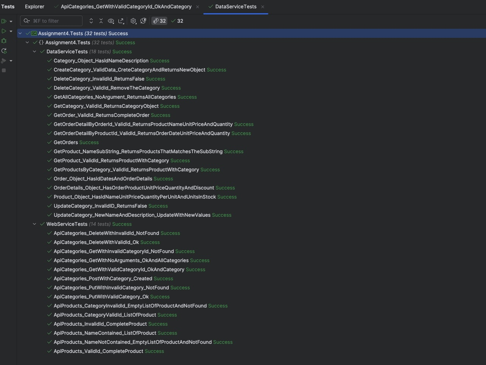

# assignment_4

> [!IMPORTANT]
> Individual work is done in seperate branches, see all [branches](https://github.com/RUC-MSc-CS-CIT-2024/assignment_4/branches) to view individual work.

GitHub: https://github.com/RUC-MSc-CS-CIT-2024/assignment_4

Group **cit11**: 
- Ida Hay Jørgensen (stud-ijoergense@ruc.dk)
- Julius Krüger Madsen (stud-juliusm@ruc.dk)
- Marek Laslo (stud-laslo@ruc.dk)
- Sofus Hilfling Nielsen (stud-sofusn@ruc.dk)

## Test Results



```
$ dotnet test -l:"console;verbosity=detailed"
  Determining projects to restore...
  All projects are up-to-date for restore.
  DataLayer -> .\DataLayer\bin\Debug\net8.0\DataLayer.dll
  Assignment4.Tests -> .\Assignment4.Tests\bin\Debug\net8.0\Assignment4.Tests.dll
Test run for .\Assignment4.Tests\bin\Debug\net8.0\Assignment4.Tests.dll (.NETCoreApp,Version=v8.0)
Microsoft (R) Test Execution Command Line Tool Version 17.8.0 (x64)
Copyright (c) Microsoft Corporation.  All rights reserved.

Starting test execution, please wait...
A total of 1 test files matched the specified pattern.
.\Assignment4.Tests\bin\Debug\net8.0\Assignment4.Tests.dll
[xUnit.net 00:00:00.00] xUnit.net VSTest Adapter v2.4.3+1b45f5407b (64-bit .NET 8.0.10)
[xUnit.net 00:00:00.21]   Discovering: Assignment4.Tests
[xUnit.net 00:00:00.22]   Discovered:  Assignment4.Tests
[xUnit.net 00:00:00.23]   Starting:    Assignment4.Tests
  Passed Assignment4.Tests.WebServiceTests.ApiProducts_NameContained_ListOfProduct [44 ms]
  Passed Assignment4.Tests.WebServiceTests.ApiCategories_DeleteWithValidId_Ok [22 ms]
  Passed Assignment4.Tests.WebServiceTests.ApiCategories_PutWithValidCategory_Ok [23 ms]
  Passed Assignment4.Tests.WebServiceTests.ApiCategories_PutWithInvalidCategory_NotFound [8 ms]
  Passed Assignment4.Tests.WebServiceTests.ApiCategories_GetWithValidCategoryId_OkAndCategory [3 ms]
  Passed Assignment4.Tests.WebServiceTests.ApiProducts_CategoryValidId_ListOfProduct [5 ms]
  Passed Assignment4.Tests.WebServiceTests.ApiProducts_CategoryInvalidId_EmptyListOfProductAndNotFound [3 ms]
  Passed Assignment4.Tests.WebServiceTests.ApiProducts_InvalidId_CompleteProduct [3 ms]
  Passed Assignment4.Tests.WebServiceTests.ApiCategories_DeleteWithInvalidId_NotFound [4 ms]
  Passed Assignment4.Tests.WebServiceTests.ApiCategories_PostWithCategory_Created [15 ms]
  Passed Assignment4.Tests.WebServiceTests.ApiProducts_ValidId_CompleteProduct [5 ms]
  Passed Assignment4.Tests.WebServiceTests.ApiCategories_GetWithInvalidCategoryId_NotFound [4 ms]
  Passed Assignment4.Tests.WebServiceTests.ApiProducts_NameNotContained_EmptyListOfProductAndNotFound [4 ms]
  Passed Assignment4.Tests.WebServiceTests.ApiCategories_GetWithNoArguments_OkAndAllCategories [4 ms]
  Passed Assignment4.Tests.DataServiceTests.CreateCategory_ValidData_CreteCategoryAndReturnsNewObject [466 ms]
  Passed Assignment4.Tests.DataServiceTests.UpdateCategory_InvalidID_ReturnsFalse [8 ms]
  Passed Assignment4.Tests.DataServiceTests.GetAllCategories_NoArgument_ReturnsAllCategories [29 ms]
  Passed Assignment4.Tests.DataServiceTests.Product_Object_HasIdNameUnitPriceQuantityPerUnitAndUnitsInStock [< 1 ms]
  Passed Assignment4.Tests.DataServiceTests.UpdateCategory_NewNameAndDescription_UpdateWithNewValues [14 ms]
  Passed Assignment4.Tests.DataServiceTests.Category_Object_HasIdNameDescription [< 1 ms]
  Passed Assignment4.Tests.DataServiceTests.OrderDetails_Object_HasOrderProductUnitPriceQuantityAndDiscount [< 1 ms]
  Passed Assignment4.Tests.DataServiceTests.GetCategory_ValidId_ReturnsCategoryObject [1 ms]
  Passed Assignment4.Tests.DataServiceTests.GetProduct_ValidId_ReturnsProductWithCategory [29 ms]
  Passed Assignment4.Tests.DataServiceTests.GetOrderDetailByProductId_ValidId_ReturnsOrderDateUnitPriceAndQuantity [25 ms]
  Passed Assignment4.Tests.DataServiceTests.GetOrders [7 ms]
  Passed Assignment4.Tests.DataServiceTests.GetProduct_NameSubString_ReturnsProductsThatMatchesTheSubString [16 ms]
[xUnit.net 00:00:00.90]   Finished:    Assignment4.Tests
  Passed Assignment4.Tests.DataServiceTests.DeleteCategory_ValidId_RemoveTheCategory [9 ms]
  Passed Assignment4.Tests.DataServiceTests.GetOrder_ValidId_ReturnsCompleteOrder [25 ms]
  Passed Assignment4.Tests.DataServiceTests.DeleteCategory_InvalidId_ReturnsFalse [1 ms]
  Passed Assignment4.Tests.DataServiceTests.GetProductsByCategory_ValidId_ReturnsProductWithCategory [6 ms]
  Passed Assignment4.Tests.DataServiceTests.Order_Object_HasIdDatesAndOrderDetails [< 1 ms]
  Passed Assignment4.Tests.DataServiceTests.GetOrderDetailByOrderId_ValidId_ReturnsProductNameUnitPriceAndQuantity [4 ms]

Test Run Successful.
Total tests: 32
     Passed: 32
 Total time: 1,1497 Seconds
```
